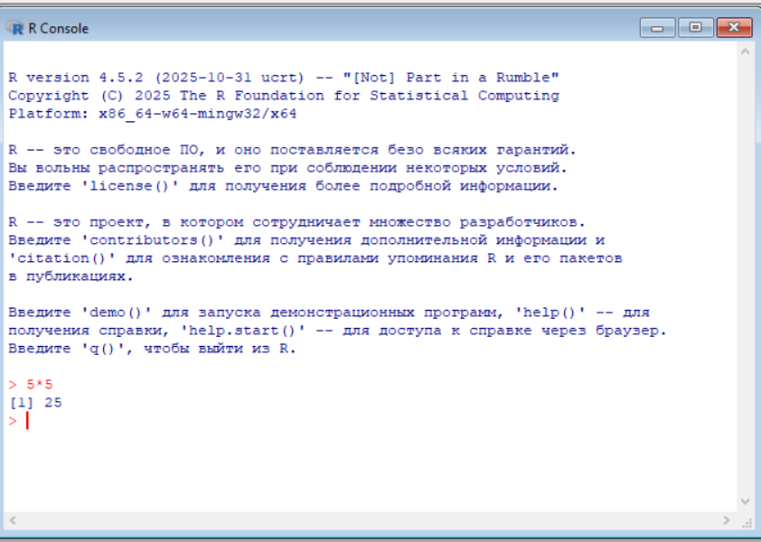

# Практическая работа №1. Введение в R

## Цель работы

1.  Развить практические навыки использования языка программирования R
    для обработки данных
2.  Развить навыки работы в Rstudio IDE:
    -   установка пакетов
    -   работа с проектами в Rstudio
    -   настройка и работа с Git
3.  Закрепить знания базовых типов данных языка R и простейших операций
    с ними

## Исходные данные

1.  Программное обеспечение Windows 10
2.  Интерпретатор языка R v4.5.2
3.  Rstudio IDE

## Ход работы

1.  Установить интерпретатор R
2.  Установить Rstudio IDE
3.  Установить программный пакет swirl:
    -   через интерфейс Rstudio IDE
    -   или функцией R `install.packages("swirl")`
4.  Запустить задание с помощью `swirl::swirl()`
5.  Выбрать из меню курсов *1. R Programming: The basics of programming
    in R*
6.  Запустить подкурсы и выполнить:
    -   базовые структурные блоки (Basic Building Blocks)
    -   рабочие пространства и файлы (Workspace and Files)
    -   последовательности чисел (Sequences of Numbers)
    -   векторы (Vectors)
    -   пропущенные значения (Missing Values)
7.  Составить отчет и выложить его и исходный *qmd/rmd* файл в свой
    репозиторий

### Шаг №1

Установим интерпретатор языка R под операционную систему Windows




### Шаг №2

Установим Rstudio IDE и отправим создадим в нем наш первый qmd-файл для
выполнения задания


Проверим работоспособность интерпретатора в IDE:


### Шаг №3

Установим пакет `swirl` (я сделаю это, используя функцию
`install.packages("swirl")`)


### Шаг №4

Запустим задание, используя `swirl::swirl()`


### Шаг №5

Выбререм из меню курсов *1. R Programming: The basics of programming in
R* и установим его


### Шаг №6

Запустим и выполним подкурсы

#### Basic Building Blocks

Найдем сумму двух чисел:

``` r
5 + 7
```

    [1] 12

Создадим переменную и сохраним в нее сумму двух чисел:

``` r
x <- 5 + 7
```

Напечатаем значение созданной выше переменной `x`:

``` r
x
```

    [1] 12

Создадим переменную `y` и запушем в нее результат разности значение
переменной `x` и числа 3:

``` r
y <- x - 3
```

Напечатаем полученное значение переменной `y`:

``` r
y
```

    [1] 9

Создадим вектор и сохраним его в переменную `z`:

``` r
z <- c(1.1, 9, 3.14)
```

Запросим подробную информацию о функции `c`:

``` r
?c
```

    starting httpd help server ... done

Напечатаем значение переменной `z`:

``` r
z
```

    [1] 1.10 9.00 3.14

Создадим вектор, значения которых будут `z`, 555 и еще раз `z`:

``` r
c(z, 555, z)
```

    [1]   1.10   9.00   3.14 555.00   1.10   9.00   3.14

Выполним арифметические операции сложения и умножения с вектором:

``` r
z * 2 + 100
```

    [1] 102.20 118.00 106.28

Получим квадратные корни чисел, равным элементам вектора `z` из которых
вычли единицу и сохраним в переменную `my_sqrt`:

``` r
my_sqrt <- sqrt(z-1)
```

Напечатаем значение переменной `my_sqrt`:

``` r
my_sqrt
```

    [1] 0.3162278 2.8284271 1.4628739

Поделим элементы `z` на элементы `my_sqrt`:

``` r
my_div <- z / my_sqrt
```

Напечатаем полученные значения:

``` r
my_div
```

    [1] 3.478505 3.181981 2.146460

Произведем сложение векторов с разными, но кратными длинами:

``` r
c(1, 2, 3, 4) + c(0, 10)
```

    [1]  1 12  3 14

Произведем сложение векторов с разными некратными длинами (Увидем
предупреждение):

``` r
c(1, 2, 3, 4) + c(0, 10, 100)
```

    Warning in c(1, 2, 3, 4) + c(0, 10, 100): longer object length is not a
    multiple of shorter object length

    [1]   1  12 103   4

Воспользуемся стрелками, чтобы просмотреть предыдущие запущенные команды
и отредактировать их (это может быть полезным в случае допущения
ошибки):

``` r
z * 2 + 1000
```

    [1] 1002.20 1018.00 1006.28

Также мы можем воспользоваться автодополнением через `TAB`, чтобы узнать
значение забытой переменной:

``` r
my_div
```

    [1] 3.478505 3.181981 2.146460

#### Workspace and Files

Посмотрим, в какой директории мы находимся:

``` r
getwd()
```

    [1] "C:/Users/FrakenboK/Documents/TI-practices/lab1"

Получим список объявленных переменных:

``` r
ls()
```

    [1] "my_div"  "my_sqrt" "x"       "y"       "z"      

Объявим переменную `x`, равную 9:

``` r
x <- 9
```

После этого еще раз взглянем на объявленные переменные:

``` r
ls()
```

    [1] "my_div"  "my_sqrt" "x"       "y"       "z"      

Посмотрим список файлов в текущей директории:

``` r
dir()
```

    [1] "images"         "lab1.qmd"       "lab1.rmarkdown" "README.md"     

Посмотрим информацию о функции:

``` r
?list.files
```

Узнаем возможные аргументы функции:

``` r
args(list.files)
```

    function (path = ".", pattern = NULL, all.files = FALSE, full.names = FALSE, 
        recursive = FALSE, ignore.case = FALSE, include.dirs = FALSE, 
        no.. = FALSE) 
    NULL

Сохраним текущую директорию в переменную `old.dir`:

``` r
old.dir <- getwd()
```

Создадим новую директорию `testdir`:

``` r
dir.create("testdir")
```

Перейдем в созданную директорию:

``` r
setwd("testdir")
```

Создадим новый файл `mytest.R`:

``` r
file.create("mytest.R")
```

    [1] TRUE

Получим новый список файлов в директории:

``` r
list.files()
```

    [1] "images"         "lab1.qmd"       "lab1.rmarkdown" "mytest.R"      
    [5] "README.md"      "testdir"       

Произведем проверку существования файла:

``` r
file.exists("mytest.R")
```

    [1] TRUE

Получим информацию о файле:

``` r
file.info("mytest.R")
```

             size isdir mode               mtime               ctime
    mytest.R    0 FALSE  666 2025-10-25 01:43:16 2025-10-25 01:43:16
                           atime exe uname  udomain
    mytest.R 2025-10-25 01:43:16  no FrakenboK ALDERSON

Переименуем созданный файл в `mytest2.R`:

``` r
file.rename("mytest.R","mytest2.R")
```

    [1] TRUE

Скопируем файл:

``` r
file.copy("mytest2.R","mytest3.R")
```

    [1] TRUE

Укажем относительный путь к файлу:

``` r
file.path("mytest3.R")
```

    [1] "mytest3.R"

Создадим путь, произведя join `folder1` и `folder2`:

``` r
file.path("folder1", "folder2")
```

    [1] "folder1/folder2"

Рекурсивное создание папок:

``` r
dir.create(file.path("testdir2", "testdir3"), recursive = TRUE)
```

Переход в изначальную директорию:

``` r
setwd(old.dir)
```

#### Sequences of Numbers

Зададим последовательность чисел от 1 до 20:

``` r
1:20
```

     [1]  1  2  3  4  5  6  7  8  9 10 11 12 13 14 15 16 17 18 19 20

Зададим последовательность дробных чисел от `pi` до 10 с шагом 1:

``` r
pi:10
```

    [1] 3.141593 4.141593 5.141593 6.141593 7.141593 8.141593 9.141593

Зададим обратную последовательность чисел от 15 до 1:

``` r
15:1
```

     [1] 15 14 13 12 11 10  9  8  7  6  5  4  3  2  1

Выведем информацию об операции:

``` r
?':'
```

Зададим последовательность чисел от 1 до 20 функцей `seq`:

``` r
seq(1,20)
```

     [1]  1  2  3  4  5  6  7  8  9 10 11 12 13 14 15 16 17 18 19 20

Зададим последовательность чисел от 1 до 10 c шагом 0.5 функцей `seq`:

``` r
seq(0,10,by=0.5)
```

     [1]  0.0  0.5  1.0  1.5  2.0  2.5  3.0  3.5  4.0  4.5  5.0  5.5  6.0  6.5  7.0
    [16]  7.5  8.0  8.5  9.0  9.5 10.0

Зададим последовательность чисел от 1 до 10 длиной 30 функцей `seq`:

``` r
seq(5, 10, length=30)
```

     [1]  5.000000  5.172414  5.344828  5.517241  5.689655  5.862069  6.034483
     [8]  6.206897  6.379310  6.551724  6.724138  6.896552  7.068966  7.241379
    [15]  7.413793  7.586207  7.758621  7.931034  8.103448  8.275862  8.448276
    [22]  8.620690  8.793103  8.965517  9.137931  9.310345  9.482759  9.655172
    [29]  9.827586 10.000000

Сохраним полученный результат в переменную `my_seq`:

``` r
my_seq <- seq(5, 10, length=30)
```

Получим длину сохраненной последовательности:

``` r
length(my_seq)
```

    [1] 30

Зададим последовательность чисел от 1 до длины последовательности,
сохраненной в переменной `my_seq`, несколькими способами:

``` r
1:length(my_seq)
```

     [1]  1  2  3  4  5  6  7  8  9 10 11 12 13 14 15 16 17 18 19 20 21 22 23 24 25
    [26] 26 27 28 29 30

``` r
seq(along.with = my_seq)
```

     [1]  1  2  3  4  5  6  7  8  9 10 11 12 13 14 15 16 17 18 19 20 21 22 23 24 25
    [26] 26 27 28 29 30

``` r
seq_along(my_seq)
```

     [1]  1  2  3  4  5  6  7  8  9 10 11 12 13 14 15 16 17 18 19 20 21 22 23 24 25
    [26] 26 27 28 29 30

Зададим вектор из 40 нулей:

``` r
rep(0,times=40)
```

     [1] 0 0 0 0 0 0 0 0 0 0 0 0 0 0 0 0 0 0 0 0 0 0 0 0 0 0 0 0 0 0 0 0 0 0 0 0 0 0
    [39] 0 0

Зададим вектор, который содержим в себе вектор `c(0, 1, 2)` 10 раз:

``` r
rep(c(0, 1, 2), times = 10)
```

     [1] 0 1 2 0 1 2 0 1 2 0 1 2 0 1 2 0 1 2 0 1 2 0 1 2 0 1 2 0 1 2

Зададим вектор, который содержим в себе все значения вектора
`c(0, 1, 2)` 10 раз:

``` r
rep(c(0, 1, 2), each = 10)
```

     [1] 0 0 0 0 0 0 0 0 0 0 1 1 1 1 1 1 1 1 1 1 2 2 2 2 2 2 2 2 2 2

#### Vectors

Зададим вектор `num_vect`, который содержит значения 0.5, 55, -10, 6:

``` r
num_vect <- c(0.5, 55, -10, 6)
```

Сохраним в переменной `expr` результат логического выражения
`num_vect < 1`:

``` r
expr <- num_vect < 1
```

Посмотрим результат логического выражения:

``` r
expr
```

    [1]  TRUE FALSE  TRUE FALSE

Получим результат еще одного логического выражения:

``` r
num_vect >= 6
```

    [1] FALSE  TRUE FALSE  TRUE

Зададим вектор, состоящий из строк:

``` r
my_char <- c("My", "name", "is")
```

Напечатаем вектор, сохраненный в переменной `my_char`:

``` r
my_char
```

    [1] "My"   "name" "is"  

Объединим все значения сохраненного вектора в единую строку:

``` r
paste(my_char, collapse = " ")
```

    [1] "My name is"

Добавим в вектор переменную `my_char` и свое имя:

``` r
my_name <- c(my_char, "Mikhail")
```

Напечатаем вектор:

``` r
my_name
```

    [1] "My"      "name"    "is"      "Mikhail"

Объединим вектор в единую строку с фразой:

``` r
paste(my_name, collapse = " ")
```

    [1] "My name is Mikhail"

Объединим “привет” и “мир” в одну строку:

``` r
paste("Hello", "world!", sep = " ")
```

    [1] "Hello world!"

Объединим элементы двух векторов без разделителей:

``` r
paste(1:3, c("X","Y","Z"), sep = "")
```

    [1] "1X" "2Y" "3Z"

Объединим элементы двух векторов разной длины:

``` r
paste(LETTERS, 1:4, sep = "-")
```

     [1] "A-1" "B-2" "C-3" "D-4" "E-1" "F-2" "G-3" "H-4" "I-1" "J-2" "K-3" "L-4"
    [13] "M-1" "N-2" "O-3" "P-4" "Q-1" "R-2" "S-3" "T-4" "U-1" "V-2" "W-3" "X-4"
    [25] "Y-1" "Z-2"

#### Missing Values

Сохраним в переменную `x` элементы с пропущенными значениями:

``` r
x <- c(44, NA, 5, NA)
```

Умножим все элементы вектора `х` на 3:

``` r
x * 3
```

    [1] 132  NA  15  NA

Сохраним вектор из тысячи случайных значений нормального распределения:

``` r
y <- rnorm(1000)
```

Сохраним y вектор из тысячи значений `NA`:

``` r
z <- rep(NA, 1000)
```

Возьмем 100 случайных элементов из векторов `y` и `z` и сохраним их в
переменную `my_data`:

``` r
my_data <- sample(c(y, z),100)
```

Сохраним в переменной `my_na` результат проверки элементов вектора
`my_data` на `NA`:

``` r
my_na <- is.na(my_data)
```

Выведем результаты проверки:

``` r
my_na
```

      [1] FALSE  TRUE FALSE  TRUE  TRUE FALSE  TRUE  TRUE  TRUE  TRUE  TRUE  TRUE
     [13] FALSE  TRUE  TRUE  TRUE  TRUE FALSE  TRUE  TRUE FALSE FALSE  TRUE FALSE
     [25]  TRUE  TRUE FALSE  TRUE  TRUE FALSE FALSE  TRUE FALSE FALSE FALSE FALSE
     [37] FALSE FALSE  TRUE FALSE FALSE FALSE FALSE FALSE  TRUE  TRUE FALSE  TRUE
     [49]  TRUE FALSE  TRUE FALSE  TRUE  TRUE  TRUE FALSE FALSE FALSE  TRUE FALSE
     [61]  TRUE  TRUE  TRUE FALSE FALSE FALSE FALSE FALSE FALSE  TRUE FALSE FALSE
     [73]  TRUE FALSE FALSE  TRUE  TRUE  TRUE FALSE FALSE FALSE  TRUE FALSE  TRUE
     [85] FALSE  TRUE  TRUE  TRUE  TRUE  TRUE FALSE FALSE  TRUE  TRUE  TRUE  TRUE
     [97]  TRUE FALSE FALSE  TRUE

Оператор `==` дает не тот же результат:

``` r
my_data == NA
```

      [1] NA NA NA NA NA NA NA NA NA NA NA NA NA NA NA NA NA NA NA NA NA NA NA NA NA
     [26] NA NA NA NA NA NA NA NA NA NA NA NA NA NA NA NA NA NA NA NA NA NA NA NA NA
     [51] NA NA NA NA NA NA NA NA NA NA NA NA NA NA NA NA NA NA NA NA NA NA NA NA NA
     [76] NA NA NA NA NA NA NA NA NA NA NA NA NA NA NA NA NA NA NA NA NA NA NA NA NA

Узнаем количество `NA` в векторе `my_data` через значения `TRUE` в
`my_na`:

``` r
sum(my_na)
```

    [1] 52

Напечатаем вектор `my_data`:

``` r
my_data
```

      [1]  0.36304954          NA -0.51678572          NA          NA  0.91738032
      [7]          NA          NA          NA          NA          NA          NA
     [13] -1.12811124          NA          NA          NA          NA  0.64002031
     [19]          NA          NA  0.26975069  0.55240245          NA -0.73872816
     [25]          NA          NA  0.89575765          NA          NA -0.75081470
     [31]  0.74740444          NA -2.65357991 -1.55638044 -1.60584184  0.46572249
     [37] -1.02089391  0.25446385          NA  0.89236923 -0.99690093 -0.18760060
     [43]  1.89144312 -0.25213214          NA          NA  0.11292633          NA
     [49]          NA -2.23203713          NA  1.50481581          NA          NA
     [55]          NA -0.44955284 -1.23601391  1.26553138          NA  0.78694797
     [61]          NA          NA          NA  0.96935048 -0.01297111 -0.23004143
     [67] -0.25650209 -0.04208715 -0.25126403          NA -0.47154277  0.22728516
     [73]          NA -1.16223404  1.16251391          NA          NA          NA
     [79] -1.35606483  0.08566281  0.31308292          NA -0.50779883          NA
     [85]  0.40184994          NA          NA          NA          NA          NA
     [91] -1.05002347  0.03571534          NA          NA          NA          NA
     [97]          NA  0.54730930  2.01165701          NA

Пропущенные значения можно получить из деления на 0:

``` r
0/0
```

    [1] NaN

Или вычитая бесконечность из бесконечности:

``` r
Inf - Inf
```

    [1] NaN

## Оценка результата

В результате лабораторной работы были изучены основы языка R с помощью
`swirl`.

## Вывод

Мы познакомились с языком R и средой разработки RStudio IDE.