# Практическая работа №8
sokol46532@yandex.ru

## Цель работы

1.  Изучить возможности технологии Yandex DataLens для визуального
    анализа структурированных наборов данных.
2.  Получить навыки визуализации данных для последующего анализа с
    помощью сервисов Yandex Cloud.
3.  Получить навыки создания решений мониторинга/SIEM на базе облачных
    продуктов и открытых программных решений.
4.  Закрепить практические навыки использования SQL для анализа данных
    сетевой активности в сегментированной корпоративной сети.

## Исходные данные

1.  Программное обеспечение ОС Windows 10
2.  RStudio
3.  Интерпретатор языка R 4.5.2

## Задание

Используя сервис Yandex DataLens настроить доступ к Yandex Query
(использованный в предыдущих практических работах) и визуально
представить результаты анализа данных.

## План

1.  Настроить интеграцию Yandex Query с DataLens. 1.1 Перейти в сервис
    DataLens. 1.2 В разделе **Подключения** выбрать **Создать
    подключение**. 1.3 В категории **Файлы и сервисы** выбрать **Yandex
    Query**.
2.  На основе запроса Yandex Query сформировать DataLens датасет.
3.  Создать три визуализации: 3.1 Круговая диаграмма распределения
    внешнего и внутреннего сетевого трафика. 3.2 Столбчатая диаграмма
    соотношения входящего и исходящего трафика внутреннего сегмента
    сети. 3.3 Линейный график динамики объёма трафика по временной
    шкале.
4.  Собрать единый дашборд со всеми графиками.

## Шаги

### Шаг 1. Настройка интеграции Yandex Query с DataLens

Начальная страница Yandex DataLens:

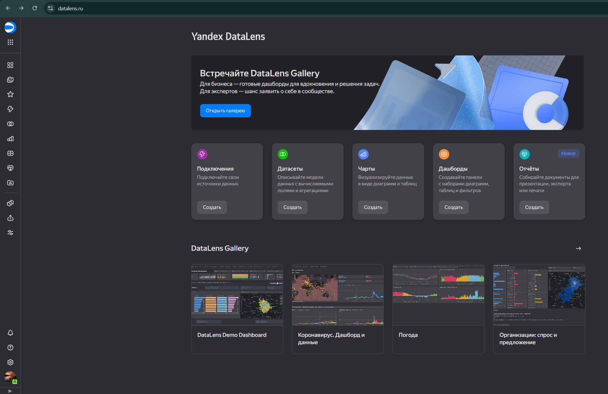

#### Шаг 1.1. Переход в нужный сервис

Просмотр доступных подключений:

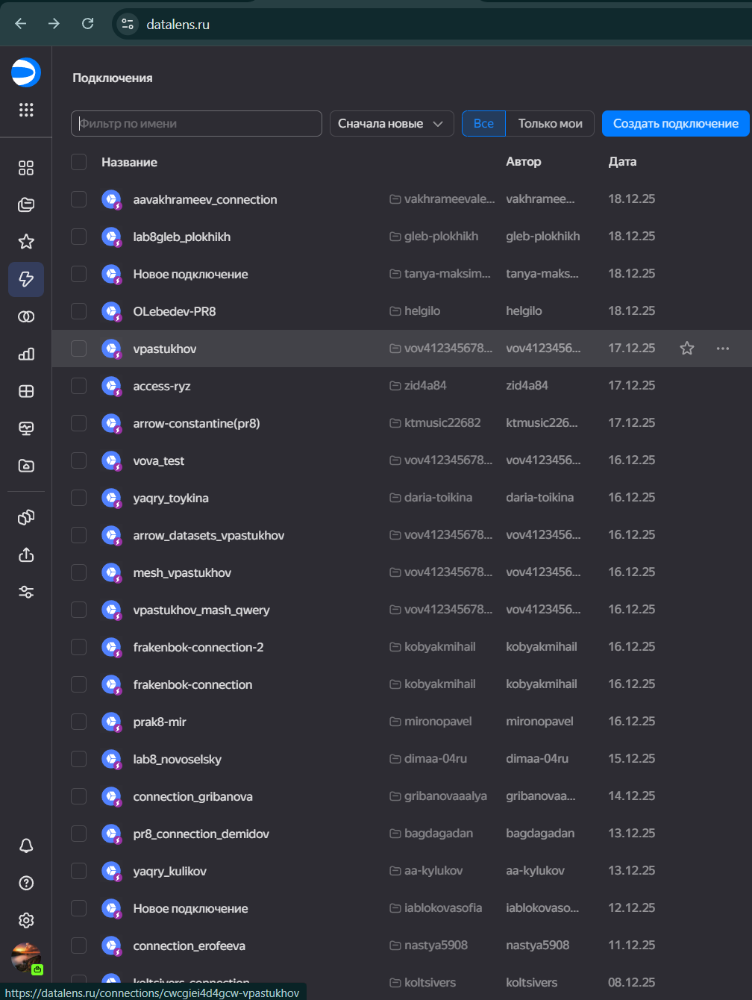

#### Шаг 1.2. Создание подключения

Окно создания нового подключения:

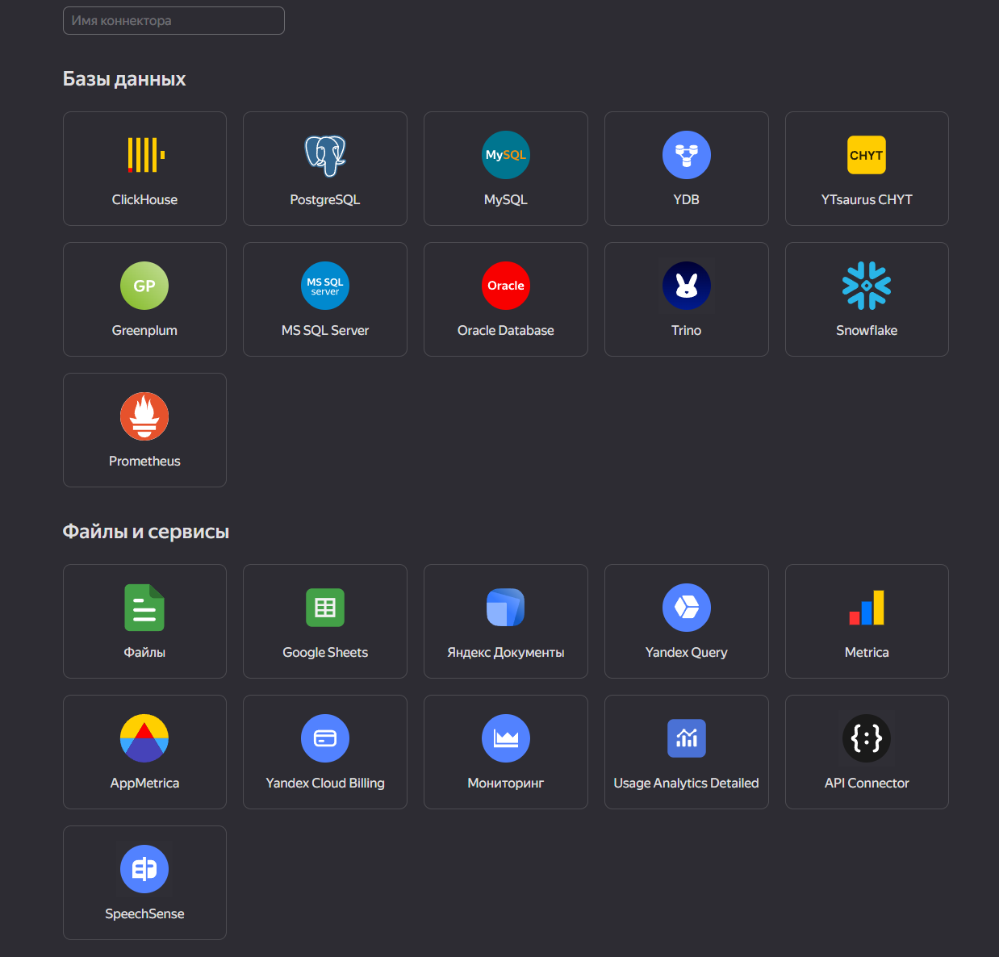

#### Шаг 1.3. Выбор Yandex Query

Выбираем источник данных **Yandex Query** в категории «Файлы и сервисы»:

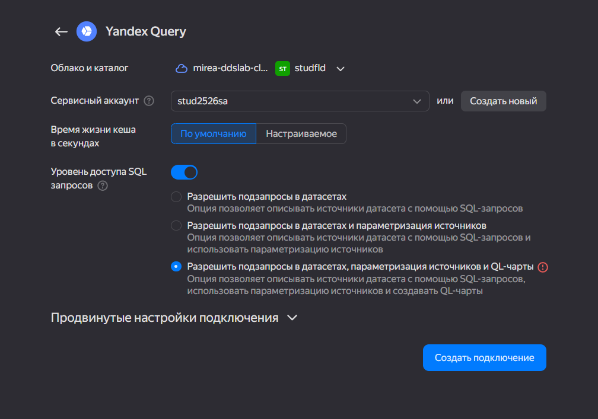

------------------------------------------------------------------------

### Шаг 2. Формирование датасета на основе запроса Yandex Query

Создаём датасет в DataLens, выбрав подключение Yandex Query и указав
SQL-запрос, который будет источником данных для визуализаций.

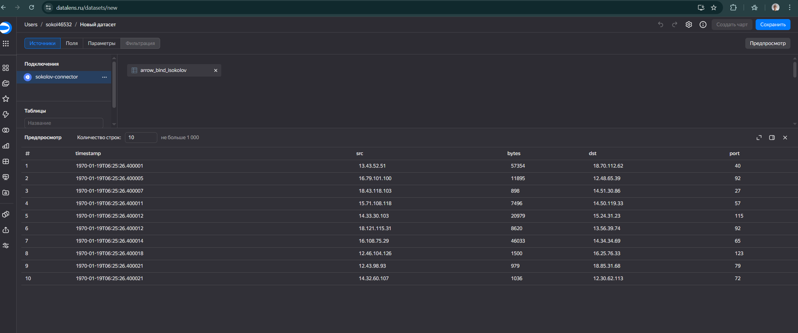

------------------------------------------------------------------------

### Шаг 3. Создание визуализаций

Начальное окно создания чарта:

## 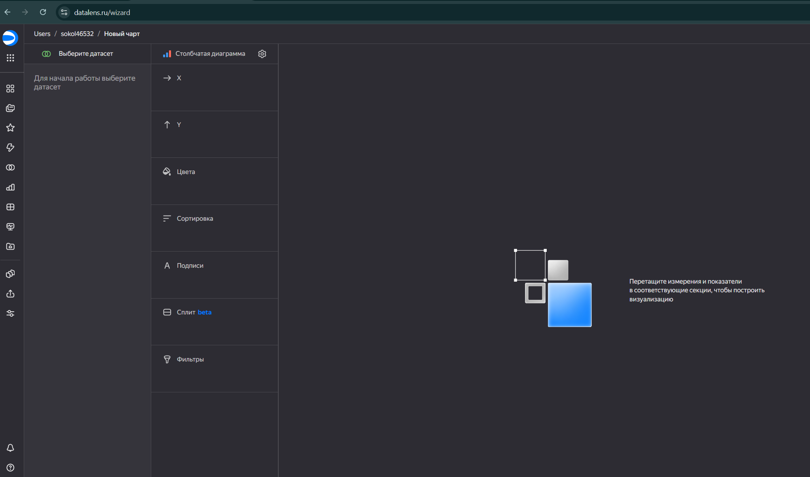

#### Шаг 3.1. Круговая диаграмма: внешний vs внутренний трафик

Поле `traffic_direction` используется для разделения трафика
(внутренний/внешний), как на скриншоте:

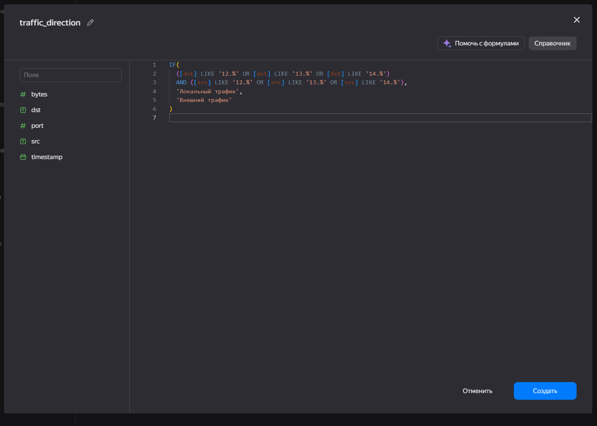

Круговая диаграмма распределения внешнего и внутреннего трафика:

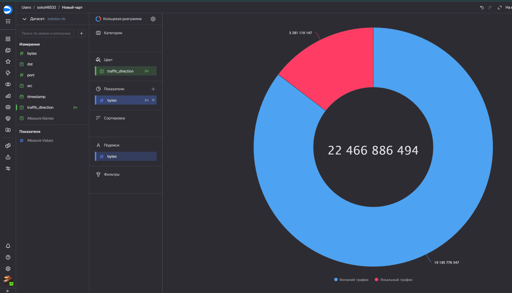

#### Шаг 3.2. Столбчатая диаграмма: входящий vs исходящий трафик внутреннего сегмента

Поле `taffic_direction_in` (как в вашем датасете) используется для
детализации направления трафика внутри сегмента:

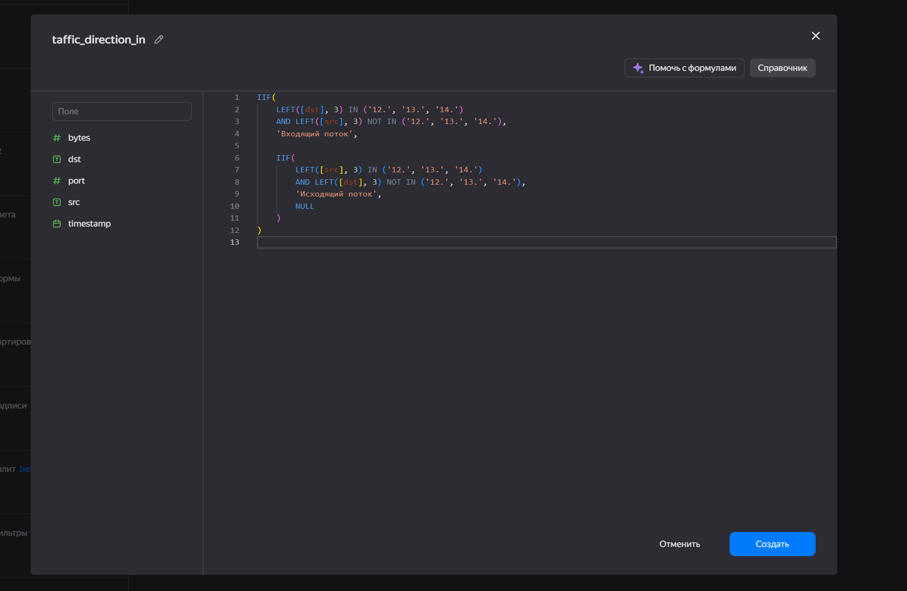

Итоговая столбчатая диаграмма:

#### Шаг 3.3. Линейный график: динамика объёма трафика по времени

Для построения временного графика сначала определим диапазон времени
(минимум и максимум), чтобы понимать длительность наблюдения:

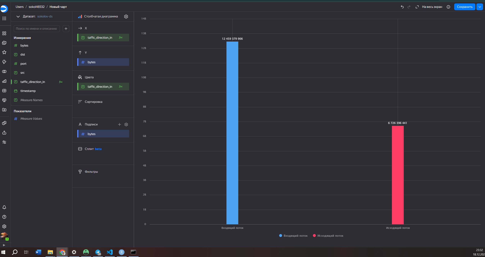

#### Шаг 3.4. Линейный график динамики трафика

Поле `traffic_size`, необходимое для построения графика:

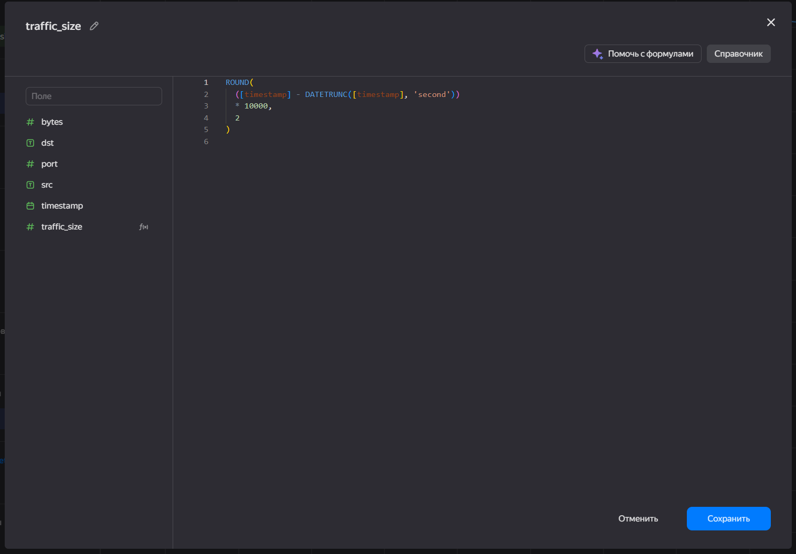

Итоговый линейный график динамики трафика:

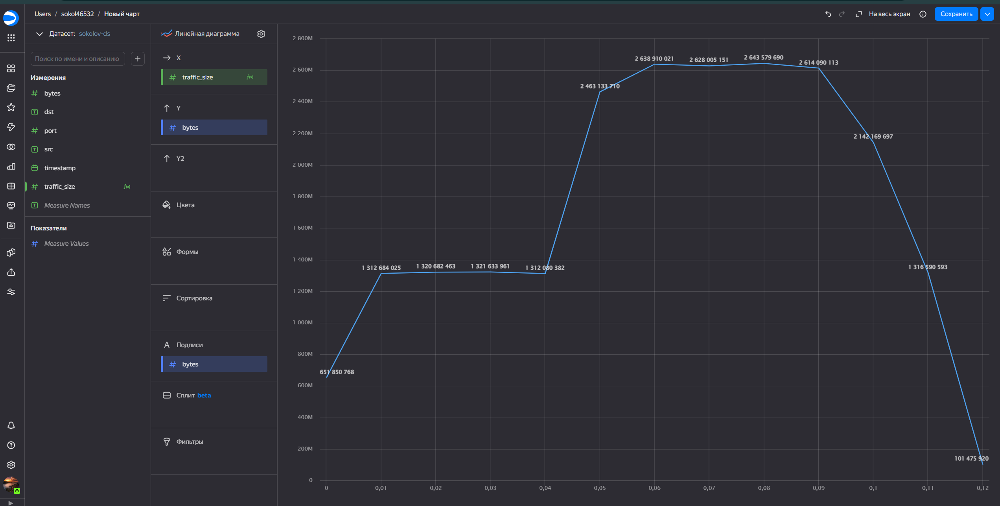

------------------------------------------------------------------------

### Шаг 4. Формирование дашборда

Итоговый дашборд со всеми визуализациями:

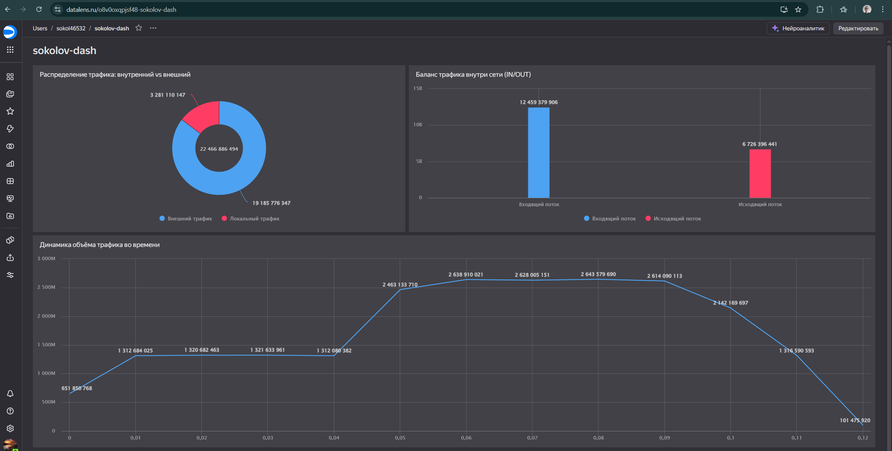

[Ссылка на дашборд](https://datalens.ru/o8v0oxqpjsf48)

## Оценка результата

В рамках практической работы было исследовано использование Yandex
DataLens для визуального анализа данных сетевой активности, полученных
через Yandex Query.

## Вывод

В ходе практической работы были изучены возможности Yandex DataLens и
отработаны основные действия по подключению Yandex Query, созданию
датасета, построению круговой/столбчатой/линейной диаграмм и сборке
итогового дашборда для анализа сетевого трафика.
